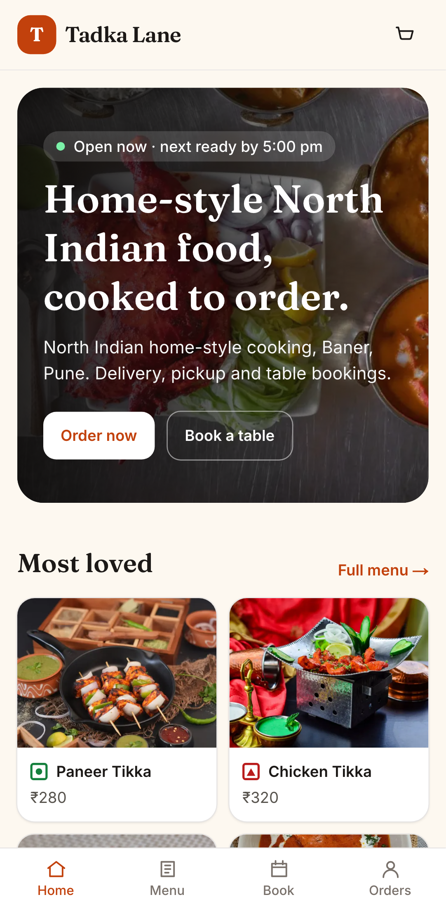
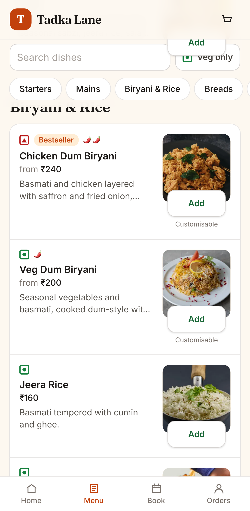
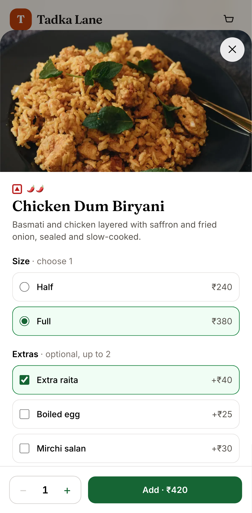
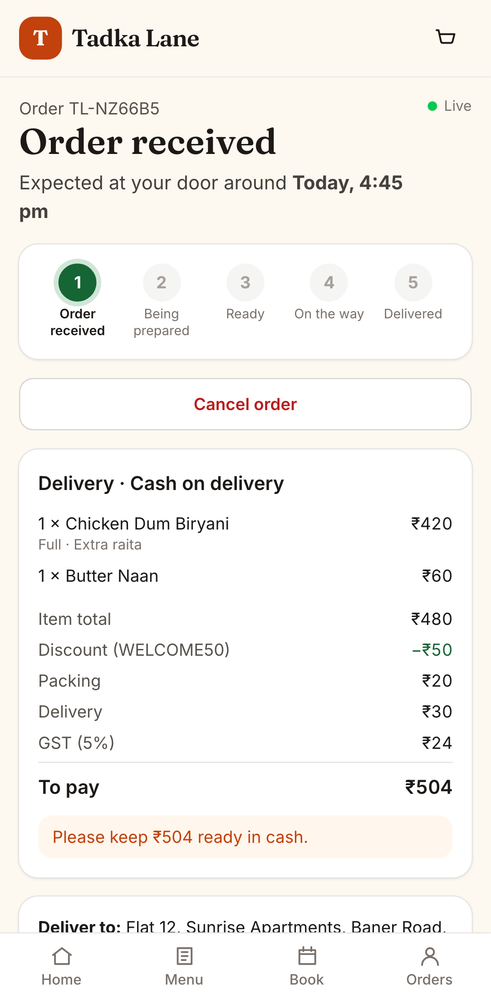
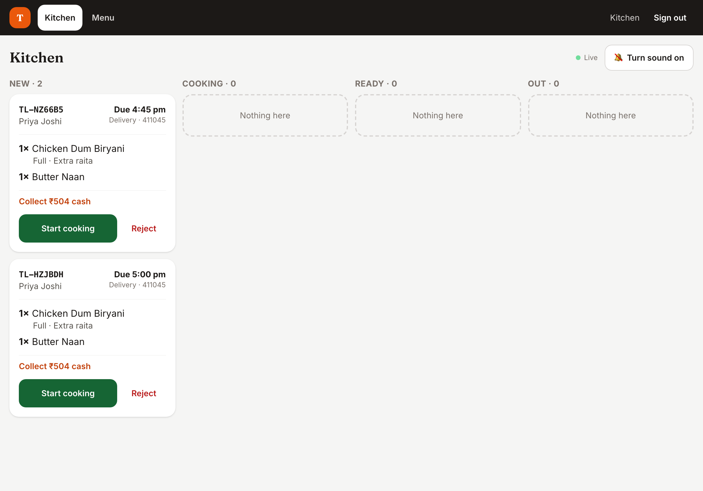
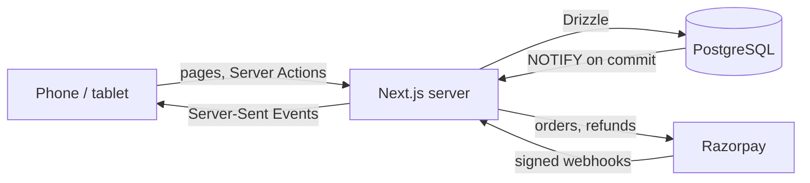

# Dinewise

[](https://github.com/rizwan-dev/dinewise/actions/workflows/ci.yml)

**Online ordering, table bookings and a live kitchen screen for a restaurant.** Customers order
from their phones for delivery or pickup and pay online through Razorpay or in cash. The kitchen
works from a tablet on the counter, and every order updates live on the customer's screen.

One installation runs one restaurant. Its name, hours, delivery area, fees and tax live in
[`web/src/config/restaurant.ts`](web/src/config/restaurant.ts); its menu, tables and staff live in
the database.

**Next.js 16 · React 19 · TypeScript · PostgreSQL · Drizzle · Tailwind · Razorpay · Docker · Playwright**

<p>
  
  
  
  
</p>



_The demo runs Tadka Lane, a fictional North Indian restaurant in Pune. Dish photos are free
stock photos from Pexels (credited below)._

## What to look at

**A kitchen slot never takes more orders than the kitchen can cook.** Orders are planned in
15-minute slots with a capacity of eight. Checkout locks the slot while it counts and adds the
order, so twelve people choosing 8pm at the same moment produce exactly eight orders and four
clear "that time has just filled up" messages. "As soon as possible" walks forward to the first
slot with room, so a rush spreads out instead of piling onto one window
([`placeOrder`](web/src/server/orders.ts)).

**A one-use coupon cannot be used twice by tapping "Place order" five times.** Each customer's
checkouts run one at a time. Locks are always taken in the same order, customer then slot, so two
checkouts can never deadlock. Both rules have tests that fire the requests in parallel against
real PostgreSQL.

**A payment is applied once, whichever message arrives first.** The order is held as "awaiting
payment" until Razorpay confirms it. Confirmation can come from the Checkout callback or the
webhook, in either order, any number of times. Each signature is checked over the exact bytes
Razorpay signed, the payment row is locked while it is applied, and each webhook event id is
processed once. If processing fails, the id is forgotten so Razorpay's retry is not mistaken for
a duplicate. A payment that lands after the order expired is refunded automatically, and so is a
paid order the kitchen has to reject.

**The browser never decides a price.** The cart lives on the phone, but it only ever sends dish
ids, choices and quantities. Every price, discount, delivery fee and the 5% GST is worked out
on the server from the current menu, in integer paise
([`quote`](web/src/domain/pricing.ts)). PostgreSQL itself refuses a bill that does not add up,
or an online order that reaches the kitchen unpaid.

**Live updates come from the database, so they work on any number of servers.** A trigger
announces every order change on a PostgreSQL channel when its transaction commits. Each server
listens once and passes changes to the kitchen screens and tracking pages connected to it over
Server-Sent Events. A rolled-back change is never announced. If the listener drops, it
reconnects and tells every page to catch up.

**A table is never booked twice.** Parties get the smallest free table that seats them, bookings
for a day are made one at a time, and an exclusion constraint stops overlapping bookings for one
table whoever writes them.

**Sign-in by one-time code, done carefully.** Codes are stored as an HMAC keyed by a server
secret, work once (even when the same correct code arrives twice at once), lock after five wrong
guesses (counted atomically, so parallel guessing cannot exceed the limit), and are limited to
three per phone per ten minutes. The demo shows the code on screen in place of an SMS.

## Easy to use on a phone

Most customers order from a mid-range Android phone, often on mobile data:

- a bottom tab bar, a floating "View cart" bar, 44px touch targets, and 16px inputs so the
  browser never zooms in;
- **Add** puts a simple dish straight in the cart; dishes with sizes or extras open a bottom
  sheet that enforces "choose 1" or "up to 2" as you tap, with the price on the button;
- veg-only switch, search, and category chips that stay on screen;
- the cart re-prices on the server as you change it, and a coupon that does not apply says why;
- checkout is one screen: saved addresses, "as soon as possible" or a scheduled slot, and
  **Pay online** or **Cash on delivery** (**Cash at pickup** for pickup), with the total on the
  button;
- the order page follows the kitchen live; customers can cancel until cooking starts, and
  reorder a past order in one tap.

For staff, the [kitchen screen](<web/src/app/staff/(console)/kitchen-board.tsx>) is built for a
tablet on the counter: one large button for the next step, a chime for new orders, late orders
in red, and the cash to collect on each ticket. Marking a dish sold out takes it off sale at
once. Managers also edit dishes and upload photos (re-encoded to WebP, which strips location
data from phone cameras), run the day's bookings and see the day's sales.

## Architecture



| Path                 | What it is                                                                |
| -------------------- | ------------------------------------------------------------------------- |
| `web/src/domain`     | Pure rules: pricing, coupons, GST, kitchen slots, tables, order status    |
| `web/src/server`     | Checkout, payments, sign-in, bookings, sales, live updates                |
| `web/drizzle`        | Migrations, including the hand-written constraints and the notify trigger |
| `web/src/app/(shop)` | The customer's pages                                                      |
| `web/src/app/staff`  | Kitchen, menu, bookings and sales                                         |
| `web/tests`          | Services against real PostgreSQL in Testcontainers                        |
| `e2e`                | Playwright on an emulated Pixel 7 against the Docker stack                |

## Run it

You need Docker.

```bash
docker compose up --build
```

Open <http://localhost:8082>. The first start creates the demo restaurant, Tadka Lane.

- **Order as a customer:** sign in with any Indian mobile number. No SMS is sent; the code is
  shown on screen.
- **Kitchen:** <http://localhost:8082/staff>, `kitchen@tadkalane.example`
- **Manager:** `manager@tadkalane.example` (also sees bookings and sales)
- Staff password: `tadka-demo-2026`. Coupons to try: `WELCOME50` (first order) and `TADKA10`.

**Online payment** appears when Razorpay test keys are set, for example in a `.env` file next to
`docker-compose.yml`:

```bash
RAZORPAY_KEY_ID=rzp_test_...
RAZORPAY_KEY_SECRET=...
RAZORPAY_WEBHOOK_SECRET=...
```

Test mode moves no real money. Without keys, customers pay in cash.

### Develop

```bash
cd web
pnpm install
pnpm test                # rules and signature checks
pnpm test:integration    # services against PostgreSQL (needs Docker)
pnpm lint && pnpm typecheck
```

End to end, against `docker compose up`:

```bash
cd e2e && pnpm install && pnpm exec playwright install chromium && pnpm test
```

### Deploy on Vercel

The same code runs as serverless functions, with Neon Postgres from the Vercel Marketplace. Set
the project's Root Directory to `web`; `vercel.json` places the functions next to the database
and schedules the daily job. What changes on serverless hosting, and why:

- **Migrations run once per deploy** (`pnpm vercel-build`), over the direct connection
  (`DATABASE_URL_UNPOOLED`), not on every cold start. Preview builds skip them, because they
  share the production database.
- **Live updates** use the same NOTIFY → Server-Sent Events path. Each stream ends after
  4½ minutes, inside the function's time limit, and the browser reconnects and catches up.
  Pages listen only while their tab is visible.
- **Housekeeping** runs when the pages that need it are loaded, at most once a minute, and from
  a daily cron (`/api/cron/daily`, authorised by `CRON_SECRET`).
- **Photo uploads are off**, because a function has no disk that outlives the request.
- A public demo sets `DEMO_DAILY_RESET=true`: the daily job wipes it and seeds it again, since
  anyone can sign in as the manager.

## Tests

| Suite            | What it covers                                                                                                                   |
| ---------------- | -------------------------------------------------------------------------------------------------------------------------------- |
| Unit (42)        | Pricing and extras, coupons, GST rounding, kitchen slots, tables, order status, Razorpay signatures                              |
| Integration (38) | Slot capacity and coupon races, payments applied once and refunds, one-time codes, bookings, live updates                        |
| End to end (8)   | A full order with the kitchen on a tablet and live tracking, a booking, sold out, rejection, a stale coupon, layout and stacking |

## Photo credits

Free photos from [Pexels](https://www.pexels.com/license/), resized for the demo. Hara Bhara
Kebab and Gajar Halwa use an illustration because no honest match was available.

| Dish                 | Photo                                            |
| -------------------- | ------------------------------------------------ |
| Amritsari Fish       | [Pexels](https://www.pexels.com/photo/20258816/) |
| Butter Chicken       | [Pexels](https://www.pexels.com/photo/37295815/) |
| Butter Naan          | [Pexels](https://www.pexels.com/photo/12737662/) |
| Chicken Dum Biryani  | [Pexels](https://www.pexels.com/photo/4224304/)  |
| Chicken Tikka        | [Pexels](https://www.pexels.com/photo/6522616/)  |
| Dal Khichdi          | [Pexels](https://www.pexels.com/photo/6363498/)  |
| Dal Makhani          | [Pexels](https://www.pexels.com/photo/37182514/) |
| Fresh Lime Soda      | [Pexels](https://www.pexels.com/photo/36268523/) |
| Garlic Naan          | [Pexels](https://www.pexels.com/photo/16851842/) |
| Gulab Jamun          | [Pexels](https://www.pexels.com/photo/7406887/)  |
| Home page spread     | [Pexels](https://www.pexels.com/photo/9792458/)  |
| Jeera Rice           | [Pexels](https://www.pexels.com/photo/28674713/) |
| Kadai Mushroom       | [Pexels](https://www.pexels.com/photo/35041660/) |
| Laccha Paratha       | [Pexels](https://www.pexels.com/photo/39833390/) |
| Masala Chaas         | [Pexels](https://www.pexels.com/photo/8489749/)  |
| Masala Chai          | [Pexels](https://www.pexels.com/photo/20270270/) |
| Masala Papad         | [Pexels](https://www.pexels.com/photo/34347890/) |
| Mutton Rogan Josh    | [Pexels](https://www.pexels.com/photo/9609846/)  |
| Paneer Butter Masala | [Pexels](https://www.pexels.com/photo/11115801/) |
| Paneer Tikka         | [Pexels](https://www.pexels.com/photo/33430556/) |
| Rasmalai             | [Pexels](https://www.pexels.com/photo/39973385/) |
| Sweet Lassi          | [Pexels](https://www.pexels.com/photo/8917283/)  |
| Tadka Lane Thali     | [Pexels](https://www.pexels.com/photo/36885763/) |
| Tandoori Roti        | [Pexels](https://www.pexels.com/photo/12737800/) |
| Veg Dum Biryani      | [Pexels](https://www.pexels.com/photo/9738983/)  |

## Licence

Code: [MIT](LICENSE) © Rizwanul Haque. Photos: under the [Pexels licence](https://www.pexels.com/license/).
